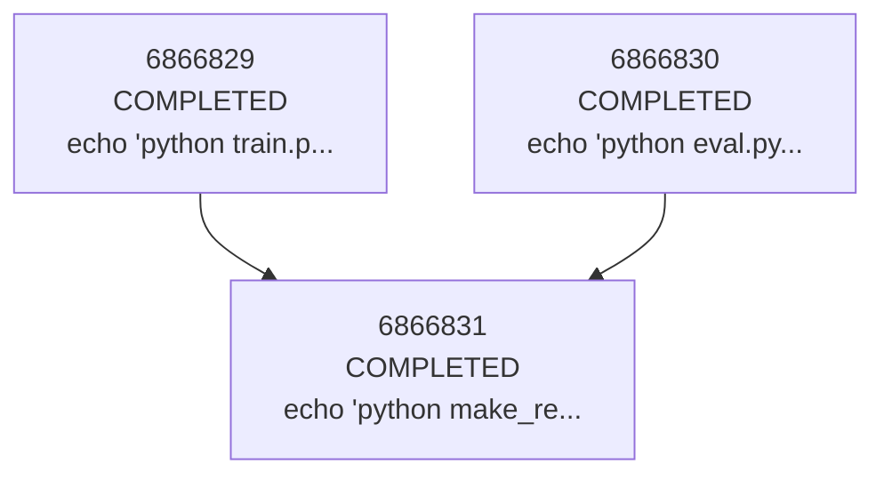

# JRun

A tool for submitting and tracking a tree of jobs to a SLURM cluster.

## Installation

```bash
pip install -e . # editable install
```

## Usage

```bash
# Submit a workflow from YAML file
jrun submit --file workflow.yaml

# Check job statuses
jrun status

# Submit a single job
jrun sbatch --cpus-per-task=4 --mem=16G --wrap="python train.py"
```

## Features

- **Job Dependencies**: Automatically manages SLURM job dependencies
- **Group ID**: Each workflow gets a unique ID for tracking related jobs
- **Parameter Sweeps**: Generate multiple jobs from parameter combinations
- **Job Tracking**: SQLite database tracks all jobs with status monitoring

## Workflow Types

### Sequential Jobs
```yaml
group:
  name: "test"
  type: sequential
  jobs:
    - group:
        type: parallel
        jobs:
          - job:
              preamble: cpu
              command: "echo 'python train.py'"

          - job:
              preamble: cpu
              command: "echo 'python eval.py'"
    - job:
        preamble: cpu
        command: "echo 'python make_report.py'"
```

#### Output:
```bash
$ jrun viz # visualize job tree
Job Dependencies:
========================================
6866829 []: (COMPLETED): echo 'python train.py'
6866830 []: (COMPLETED): echo 'python eval.py'
6866831 []: (PENDING): echo 'python make_report.py' <- 6866829, 6866830
```



### Parameter Sweeps
```yaml
group:
  name: "sweep-example"
  type: sweep
  preamble: base
  sweep:
    lr: [0.001, 0.01, 0.1]
    model: ["resnet", "vgg"]
  sweep_template: "python train.py --lr {lr} --model {model}"
```

This creates 6 jobs (3 × 2 combinations) automatically.

### Parallel Jobs
```yaml
group:
  name: "parallel-example"
  type: parallel
  jobs:
    - job:
        preamble: base
        command: "python train_model_a.py"
    - job:
        preamble: base
        command: "python train_model_b.py"
```

## Group ID Feature

Use `{group_id}` in commands to link jobs

```yaml
group:
  name: "main"
  type: parallel
  jobs:
    - group:
        type: sweep
        preamble: gpu
        sweep:
          lr: [5e-4, 1e-4, 5e-5]
        sweep_template:  "python train.py lr {lr} --group_id {group_id}"  # (e.g., aaa-bbb-ccc)

    - job:
        preamble: cpu
        command: "python eval.py --group_id {group_id}" # (e.g., aaa-bbb)
```

## Example Complete Workflow

```yaml
preambles:
  base:
    - "#!/bin/bash"
    - "#SBATCH --cpus-per-task=4"
    - "#SBATCH --mem=8G"

group:
  name: "example-workflow"
  type: sequential
  jobs:
    - job:
        preamble: base
        command: "python preprocess.py --group_id {group_id}"
    
    - group:
        type: sweep
        preamble: base
        sweep:
          lr: [0.001, 0.01]
        sweep_template: "python train.py --lr {lr} --group_id {group_id}"
    
    - job:
        preamble: base
        command: "python evaluate.py --group_id {group_id}"
```

## Requirements

- Python 3.6+
- SLURM environment
- PyYAML >= 6.0
- tabulate >= 0.9.0