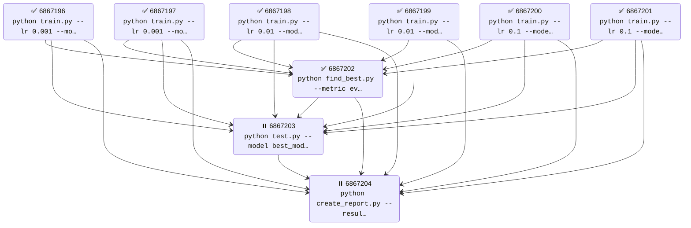

<!-- ─────────────────────────────  HERO  ───────────────────────────── -->
<div align="center">

  <h1>🌳 AGORA</h1>
  <p><em>Submit &amp; track job-trees on SLURM with one command.</em></p>

  <p>
    &nbsp;
    &nbsp;

  </p>

</div>


<br/>




## Installation

```bash
pip install -e . # editable install
```

## Usage

```bash
# Submit a workflow from YAML file
agora submit --file workflow.yaml

# Check job statuses
agora status

# Submit a single job
agora sbatch --cpus-per-task=4 --mem=16G --wrap="python train.py"
```

## Quick start

#### Define a machine learning workflow

```yaml
# This example shows a typical ML pipeline:
# 1. Train multiple models in parallel
# 2. Evaluate all models
# 3. Generate a comparison report
group:
  name: "ml-pipeline"
  type: sequential
  jobs:
    - group: 
        name: "training"
        type: parallel
        jobs:
          - job:
              preamble: gpu
              command: "python train.py --model resnet --lr 0.001 --epochs 100"

          - job:
              preamble: gpu
              command: "python train.py --model vgg --lr 0.001 --epochs 100"
              
          - job:
              preamble: gpu
              command: "python train.py --model efficientnet --lr 0.001 --epochs 100"
    
    - job:
        preamble: cpu
        command: "python evaluate.py --models resnet vgg efficientnet"
        
    - job:
        preamble: cpu
        command: "python generate_report.py --output results_comparison.pdf"

# Define resource configurations
preambles:
  gpu:
    - "#!/bin/bash"
    - "#SBATCH --gres=gpu:1"
    - "#SBATCH --cpus-per-task=4"
    - "#SBATCH --mem=16G"
    - "#SBATCH --time=24:00:00"
    - "#SBATCH --output=logs/train_%j.out"
    - "#SBATCH --error=logs/train_%j.err"
  
  cpu:
    - "#!/bin/bash"
    - "#SBATCH --cpus-per-task=8"
    - "#SBATCH --mem=32G"
    - "#SBATCH --time=4:00:00"
    - "#SBATCH --output=logs/eval_%j.out"
    - "#SBATCH --error=logs/eval_%j.err"
```

#### Submit and monitor your workflow
```bash
$ agora submit --file ml_pipeline.yaml
Submitted workflow: ml-pipeline (ID: abc-123-def)

$ agora status
Job Dependencies:
========================================
6866829 [training]: (RUNNING): python train.py --model resnet --lr 0.001 --epochs 100
6866830 [training]: (RUNNING): python train.py --model vgg --lr 0.001 --epochs 100
6866831 [training]: (RUNNING): python train.py --model efficientnet --lr 0.001 --epochs 100
6866832 []: (PENDING): python evaluate.py --models resnet vgg efficientnet <- 6866829, 6866830, 6866831
6866833 []: (PENDING): python generate_report.py --output results_comparison.pdf <- 6866832

$ agora viz  # Visualize the dependency graph
```


## Workflow Types

### Parameter Sweeps
```yaml
group:
  name: "sweep-example"
  type: sweep
  preamble: base
  sweep:
    lr: [0.001, 0.01, 0.1]
    model: ["resnet", "vgg"]
  sweep_template: "python train.py --lr {lr} --model {model}"
```

This creates 6 jobs (3 × 2 combinations) automatically.

### Parallel Jobs
```yaml
group:
  name: "parallel-example"
  type: parallel
  jobs:
    - job:
        preamble: base
        command: "python train_model_a.py"
    - job:
        preamble: base
        command: "python train_model_b.py"
```

### Link jobs with group ids 
Each job has a `group_id` which acts as an address of where it lives. You can use this to link scripts. For example, maybe you have a `python eval.py` that accepts a group_id param and uses it to filter out which checkpoint to run eval on.

```yaml
# Use `{group_id}` in commands to link jobs
group:
  name: "main"
  type: parallel
  jobs:
    - group:
        type: sweep
        preamble: gpu
        sweep:
          lr: [5e-4, 1e-4, 5e-5]
        sweep_template:  "python train.py lr {lr} --group_id {group_id}"  # (e.g., aaa-bbb-ccc)

    - job:
        preamble: cpu
        command: "python eval.py --group_id {group_id}" # (e.g., aaa-bbb)
```

# 🌳 AGORA Features & Status

## Current Features
- [x] Submit job trees from YAML files (`agora submit --file workflow.yaml`)
- [x] Monitor job status with visualization (`agora status`, `agora viz`)
- [x] Parameter sweeps and parallel job execution
- [x] Job graph vizualization
- [x] CLI filtering (`agora status --filter status=COMPLETED`)
- [x] Job retry (`agora retry JOB_ID`)
- [x] Job delete subgraph
- [x] Web app
- [x] Improve visual for loop group
- [x] Improve dependency (make markovian)
- [x] View job logs in browser
- [x] Delete by node
- [x] Add sweep_idx

## Planned Features
- [ ] Bugfix: retry not auto updating old job id to new id in deps table
- [ ] Update afterany (allow some parent group failures)
- [ ] Update node color code (mixed with pending should be blue/active)


<!-- sacct -j 6894879 --format=JobID,WorkDir -X --parsable2 -->

## Requirements

- Python 3.6+
- SLURM environment
- PyYAML >= 6.0
- tabulate >= 0.9.0